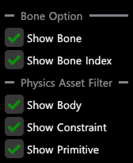

# W12 T2 기술 문서

## UPhysicsAsset Save&Load
- SkeletalMesh 에 대해서 모든 Bone에 `UBodySetup`을, 모든 BodySetup들 사이에 Constraint를 만들어줌
- `FArchive`를 통해 `UPhysicsAsset`을 Binary로 Save & Load
- `Contents/PhysicsAsset` 디렉토리에 `.siu` 확장자 파일로 저장
  
## Physics Asset Editor
- 조작
    - Skeletal Tree의 Node 우클릭 시 생성, 삭제 가능
    - 키보드 `F` 키를 통해 `Constarint`, `Bone`, `AggregateGeometry`에 Camera Focus 가능
    - 키보드 `Delete` 키 불가능
    - 

- Tree Option
    - 아래의 Option Flag에 따른 Tree 시각화

    

## Simulate Static/SkeletalMesh
- 물리 씬에 등록
  -  `FPhysicsSolver::RegisterObject`를 통해 진행
  - 피직스 액터는 월드 기준으로 등록되어야 하기 때문에 각 컴포넌트를 월드로 보내는 행렬인 `InitialMatrix`를 인자로 받음
  - 인자로 받은 `FBodyInstance`의 `ExternalCollisionProfileBodySetup`에 포함된 `FKAggregateGeom`구조체의 Geometry들을 등록
          - 피직스 액터에 대한 상대 Transform으로 등록

- 물리 씬의 시뮬레이션 결과 싱크
  - StaticMeshComp
    - 컴포넌트의 `SetWorldTransform`함수를 통해 직접 적용
  - SkeletalMeshComp
    - 월드 공간의 피직스 액터의 트랜스폼을 Bone Hierarchy 공간으로 보내야 하므로 다음의 과정을 진행
      - 부모 Bone의 컴포넌트 공간 Transform을 가져옴
      - 컴포넌트의 World Transform을 가져옴
      - 부모 Bone의 컴포넌트 공간 Transform.Inverse() * 컴포넌트의 World Transform.Inverse() * 피직스 액터의 World Transform을 계산
      - 계산된 결과로 갱신

  ## Ragdoll Simulation
  - Joint 생성
      -  `FConstraintInstance`와 이어줄 Parent, Child의 `PxActor`를 인자로 받는 `FPhysicsSolver::CreateJoint`함수를 통해 물리 씬에 등록
      -  Child를 Identity로 하는 Joint관계를 생성
      -  `FConstraintInstance`의 데이터를 기반으로 Joint의 수치들을 설정
          -   Twist 및  Swing의 각도
          -   `bSoftConstraint`가 True일 경우, PxSpring을 추가하여 감쇠 추가
                
                
 ## Vehicle4W System
  -  **AWheeledVehiclePawn**: StaticMeshComponent(차체) + 4×StaticMeshComponent(바퀴) 생성
  -  **UVehicleMovementComponent** 추가: 물리 파라미터 보관
  -  스폰 시 `FPhysScene::AddVehicle` → `FPhysicsSolver::RegisterObject` 호출하여 PhysX에 차량 등록

- Movement Component 파라미터
  -  **ChassisMass**, **ChassisBoxExtents**: 질량·크기
  -  **WheelMass**, **WheelRadius/Width**, **WheelOffset**: 바퀴 질량·형상·위치
  -  **ChassisCMOffset**: 무게중심 오프셋
  -  **PeakTorque**, **MaxOmega**, **ClutchStrength**: 엔진 구동 파라미터
  -  `Duplicate()` 오버라이드로 컴포넌트 복제 시 값 유지

- PhysX 통합 (FVehicle4W)
  -  **InitVehicle**: `PxVehicleDrive4W` 생성 (서스펜션, 타이어, 엔진 설정)
  -  **좌표계 보정**: PhysX(X축 전진) ↔ 엔진(Y축 전진) 90° 회전 쿼터니언(`InvPhysXQuat`) 적용
  -  PhysX Actor `userData`에 `FBodyInstance` 연결

- 시뮬레이션 & 결과 동기화
  -  매 프레임 `FPhysicsSolver::AdvanceOneTimeStep` → PhysX `simulate(Dt)`
  -  `FetchData`
    -  차체 Transform 자동 적용
    -  바퀴 로컬 포즈(fetch) → `InvPhysXQuat` 보정 → 메시 상대 회전 설정
    -  **현재**: 바퀴 회전 시각화 로직 이슈로 임시 주석 처리
